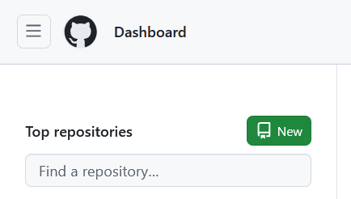
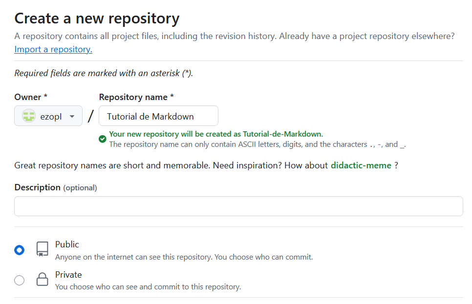
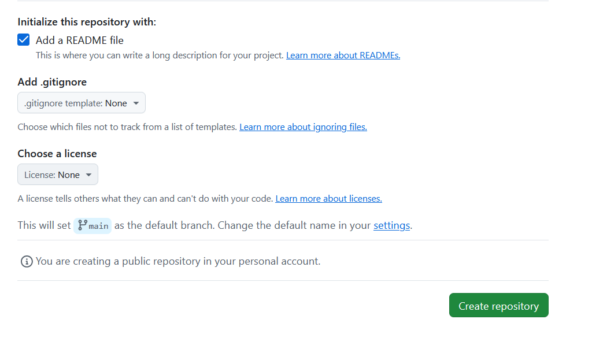
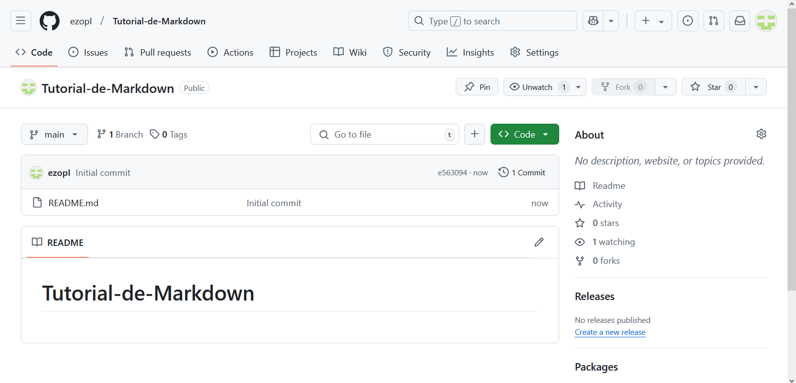
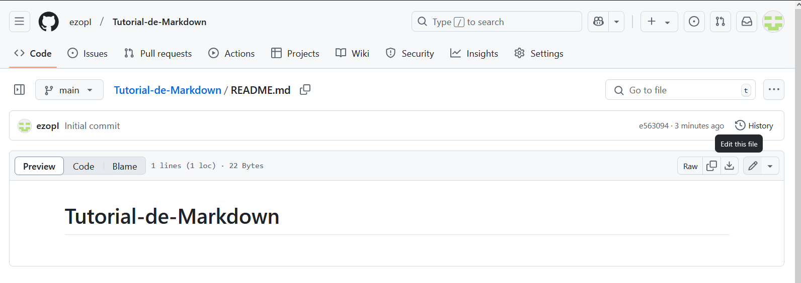
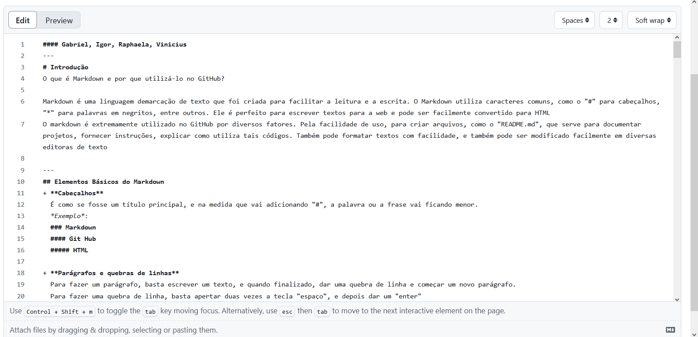
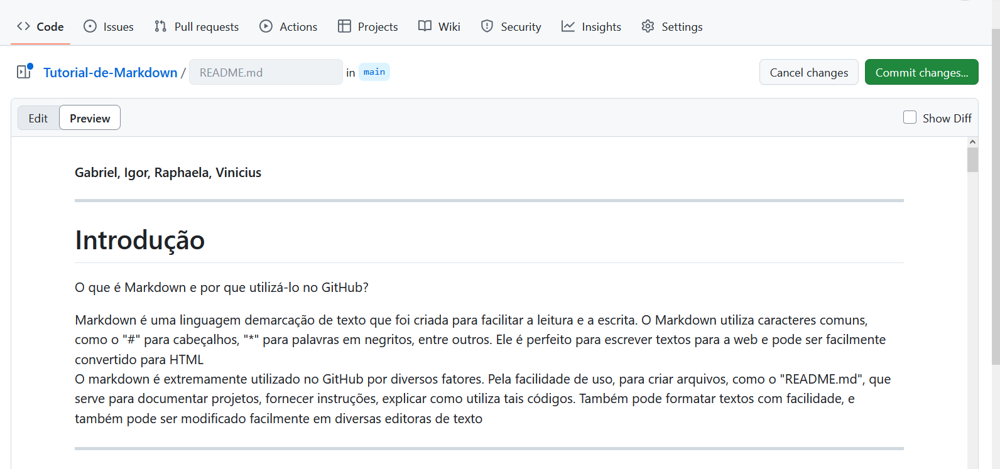

#### Gabriel, Igor, Raphaela, Vinicius
---
# Introdução  
O que é Markdown e por que utilizá-lo no GitHub?

Markdown é uma linguagem demarcação de texto que foi criada para facilitar a leitura e a escrita. O Markdown utiliza caracteres comuns, como o "#" para cabeçalhos, "*" para palavras em negritos, entre outros. Ele é perfeito para escrever textos para a web e pode ser facilmente convertido para HTML  
O markdown é extremamente utilizado no GitHub por diversos fatores. Pela facilidade de uso, para criar arquivos, como o "README.md", que serve para documentar projetos, fornecer instruções, explicar como utiliza tais códigos. Também pode formatar textos com facilidade, e também pode ser modificado facilmente em diversas editoras de texto  

---  
## Elementos Básicos do Markdown  
+ **Cabeçalhos**  
  É como se fosse um título principal, e na medida que vai adicionando "#", a palavra ou a frase vai ficando menor.  
  *Exemplo*:
  ### Markdown  
  #### Git Hub
  ##### HTML 

+ **Parágrafos e quebras de linhas**  
  Para fazer um parágrafo, basta escrever um texto, e quando finalizado, dar uma quebra de linha e começar um novo parágrafo.  
  Para fazer uma quebra de linha, basta apertar duas vezes a tecla "espaço", e depois dar um "enter"  

+ **Linhas horizontais**  
  Para fazer linhas horizontais, basta apertar 3 vezes a tecla traço "-". Porém, você também pode apertar 3 vezes a tecla underline "_", ou apertar 3 vezes a tecla asteristico "*", pois os 3 funcionarão da mesma forma.  

  **Comentários invisíveis**  
  Não existe uma sintaxe oficial no markdown para fazer comentários invisíveis, porém, você pode utilizar atalhos cpm html por exemplo.  
  Dessa forma, você utilizará a tag `<!-- -->`.

# Formatação de texto

### Ênfase
Vamos falar agora sobre as ênfases que podemos colocar nos textos.  

Vamos começar com o **negrito**, ele é representados por duplos asteríscos nas extremidades dos textos.  
`ex:` \*\*TEXTO\*\*.  

---

Agora temos um bem famoso *itálico*, a representação desse código de dá por apenas um asterísco em cada extremidade.  
`ex:` \*TEXTO\*

---

Por último temos o ~~riscado~~. Nele precisamos utilizar duplos til nas extremidades dos textos.  
`ex:` \~\~TEXTO\~\~

### Citações e blocos de citações

Uma citação pode ser usada para destacar alguma informações importante necessária no texto. Ele é representado pelo sinal de maior.  
`ex:` \>TEXTO
> Isso pode destacar um informação muito importante!

Já um bloco de citação é usado para destacar várias informações dentro do próprio bloco de citação.  
`ex:` 
```
> TEXTO
> TEXTO
> > TEXTO
``` 

> Dó é a primeira tecla do piano  
> Ré é dissonante do Dó  
> > Dó, Mí e Sol são notas harmônicas  

### Exibição de comandos no texto

Usamos as cráses \` TEXTO \` para podermos representar códigos dentro do nosso arquivo.  
`ex:`  
`printf("Olá Mundo!")`

# Trabalhando com listas

Aqui abordaremos todos os tipos de listas e como executa-los

### Listas ordenadas e não ordenadas

Primeiro tipo temos as listas ordenadas que são sequenciais por números.  
``` C
ex: 1. TEXTO
    2. TEXTO
    3. TEXTO
```
    1. TEXTO
       1.1. TEXTO
            1.1.1 TEXTO

Assim podemos colocar sublistas dentro de uma lista principal

Também possuimos as listas não ordenadas que são representadas por ' \*; \+ e \- ' , podendo ser usado qualquer um em qualquer ordem.  
`ex:`  

+ TEXTO
  * TEXTO
    - TEXTO

### Listas de tarefas

Uma simples lista para marcar se está completo ou não. O uso é muito eficiente em projetos do dia a dia e para outras utilidades. É representado por \-\[ \] e pode ser marcado com um X nos que já foram completos.  
`ex:`
- [x] Ler
- [ ] Escrever
- [x] Nadar

### Listas com numeração não sequencial

É uma lista que não segue nenhum padrão, nela é necessário fazer uma entrada diferente para chegar nesse resultado, no caso é colocar uma \/ antes do \. ponto final. Um exemplo de listas com numeração não sequencial é anos.  
`ex:`  
  1992\. TEXTO  
  1999\. TEXTO    
  2010\. TEXTO  


# Links e referências

  <p style="text-align:center">LINK SIMPLES</p>

[Texto do link] (URL)  

`exemplo:`

[Sephora](https://www.sephora.com.br/?utm_source=google&utm_medium=cpc&utm_campaign=institucional&gad_source=1&gclid=EAIaIQobChMI9uPrp7K_iwMVfzatBh279xVzEAAYASAAEgKx9vD_BwE)

<p style="text-align:center">LINK COM REFERÊNCIA</p>

[Texto do link][1]  
[1]: URL 

`exemplo:`

[Sephora]
(https://www.sephora.com.br/?utm_source=google&utm_medium=cpc&utm_campaign=institucional&gad_source=1&gclid=EAIaIQobChMI9uPrp7K_iwMVfzatBh279xVzEAAYASAAEgKx9vD_BwE) 

# Imagens e mídia

<p style="text-align:center">IMAGEM LOCAL</p>

![Texto alternativo] (caminho/para/imagem.jpg) 

`exemplo:`  


<p style="text-align:center">IMAGEM DA INTERNET</p>


`exemplo:`  
  


# Trabalhando com Código  
### Codigo inline e em blocos.
Os codigos inlines são bastante usados para explicar como um função funciona como por exemplo: `printf("Ola mundo!");`


O exemplo de codigo utilizado acima não sera executado, pois como eu havia dito anteriormente são usados apenas para ilustrações e exemplos. 

***Como utilizar?***  
Sempre que você for fazer alguma explicação de codigo o função, utilize ***``*** um no começo do codigo e outro no final.

Já os codigos em boclos são usados para exibir trechos maiores ou mais estruturados de código em um formato mais destacado e legível.

***Como utilizar?***  
Sempre no começo de cada codigo utilizar ***```***

Isso vai aparecer como um bloco de código formatado assim:

```python
def saudacao():
    print("Olá, mundo!")

saudacao()
```  
---
### Uso de destaque para diferentes linguagens  
  
Há varios meios de destaques no markdown, vou citar uns deles a seguir.  

  
| Destaque | Como usar |
| ---- | :---: |
| **Negrito** | ** |
| *Itálico* | * |
| ~~Riscado~~ | ~~ |
| <ins>Sublinhado</ins> | \<ins> |
| `Código` | `` |
| ```Bloco de Codigo``` | ``` |  
  Para utilizar use no começo e no fim da frase ou palavra.  

# Elementos Avançados  
### Tabelas e alinhamentos  
| Nome | Idade |
| ---- | :---: |
| Carlos | 21 |
| Vinicius | 16 |
| Cinthia | 55 |  
  
  Para a realização de tabelas precisamos usar | separando os elementos sempre um no começo e um no fim.  
    
E para o alinhamento utilizamos <b>**:**</b> 

| Alinhamento | Como utilzar? |  
| --- | :---: |
| Direita |  \---: |
| Esquerda | \:--- |
| Centro | \:---: |
  
### Notas de rodapé  
Para fazer notas de rodapé utilizamos [^1], e para adicionar no local que queremos usamos [^1]: (E a frase que voce quer adicionar a essa nota.)  
  
### Emojis e Badges  

Para utilizarmos emojis podemos consultar no site. [Clique aqui](https://github.com/hideraldus13/github-emoji)
  
  ### Badges  
---  
| Tipos | Como utilizar? | 
| --- | :---: |
| Badge de Imagem | `` |  
| Badge Clicável | `[](URL_DO_DESTINO)` |  
  
Podemos também personalizar Badges com **Shields.io**, como por exemplo:   

`https://img.shields.io/badge/TEXTO1-TEXTO2-COR?style=ESTILO`   
 
| Parâmetro | Descrição | Exemplo |  
| --- | --- | --- |   
| `TEXTO1` | Texto principal | `"Status"` |  
| `TEXTO2` | Texto secundário | `"Online"` |  
| `COR` | Cor de fundo | `"red"`, `"blue"`, `"orange"` |  
| `style=` | Estilo do badge | `"flat"`, `"for-the-badge"`, `"plastic"` |


Abaixo temos os três estilos de Badges:  

  **Flag**  
 **Plastic**   
 **For The Badge**  
  
### Integração com HTML para personalização.  
Assim como temos varios meio de personalização em Markdown também temos em **HMTL** veja os exemplos a seguir...
  
### <b>Meios de Destaques</b>

| Tag (desuso) | Tag (Semântica) | Descrição |
|-------------|----------------|------------|
| `<b> </b>`  | `<strong> </strong>` | **Efeito de negrito** |
| `<i> </i>`  | `<em> </em>` | *Efeito de itálico* |
| `<u> </u>`  | `<ins> </ins>` | <u>texto sublinhado</u> |
| `<s> </s>`  | `<del> </del>` | ~~texto riscado~~ |


### <b>Tags para formatação</b>   

| Tag | Descrição |
|------|:-----------:|
| `<tt> </tt>` | Fonte teletipo apresenta o mesmo tamanho e tipo, utilizada para expressar trechos de códigos. |
| `<sub> </sub>` | Texto <sub>subscrito</sub> |
| `<sup> </sup>` | Texto <sup>sobrescrito</sup> |
| `<big> </big>` | **Texto maior do que o normal** |
| `<small> </small>` | Texto menor do que o normal |
| `<mark> </mark>` | ==Realça partes de um texto== |
| `<pre> </pre>` | Texto pré-formatado |
| `<cite> </cite>` | Definir o título de uma obra |
| `<blockquote> </blockquote>` | Seção que é citada de outra fonte |
| `<q> </q>` | Citação curta |
| `<code> </code>` | `Trechos de códigos computacionais` |
  
  
#### E por fim temos os caracteres especiais:  
  
| Caracter | Código HTML | Caracter | Código HTML | Caracter | Código HTML |
|----------|------------|----------|------------|----------|------------|
| Å        | `&Aring;`  | å        | `&aring;`  | ¢        | `&#162;`  |
| Æ        | `&AElig;`  | æ        | `&aelig;`  | £        | `&#163;`  |
| Ø        | `&Oslash;` | ø        | `&oslash;` | ª        | `&#170;`  |
| Ð        | `&ETH;`    | ð        | `&eth;`    | ²        | `&#178;`  |
| Ý        | `&Yacute;` | ý        | `&yacute;` | ¼        | `&#188;`  |
| Þ        | `&THORN;`  | þ        | `&thorn;`  | ±        | `&#177;`  |
| ß        | `&szlig;`  | "        | `&quot;`   | ×        | `&#215;`  |
| <        | `&lt;`     | >        | `&gt;`     | «        | `&#171;`  |
| ®        | `&reg;`    | ©        | `&copy;`   | ¿        | `&#191;`  |  


# Criando um repositório  
Para criar um repositório clicamos em "New" decidimos um nome para o repositório, fazemos uma descrição, tornamos publico ou privado, selecionamos README file e por ultimo clicamos em "Create repository".

# Publicação no GitHub

### Criando um repositório



Clicamos no botão 

---


> Colocamos o nome do novo repositório;
> Descrição é opcional;
> Público: Visível para toda plataforma GitHub.

---


Adicionamos um `ReadmeFile`, para poder adicionar instruções, descrição e especificação.
Assim podemos clicar no 

---

> Entrar no arquivo README

---

> Editar e então colar seu código

### Enviando o arquivo Markdown
---


> Aqui está o modo code

---


Modo preview, mostrando o resultado pronto para um

